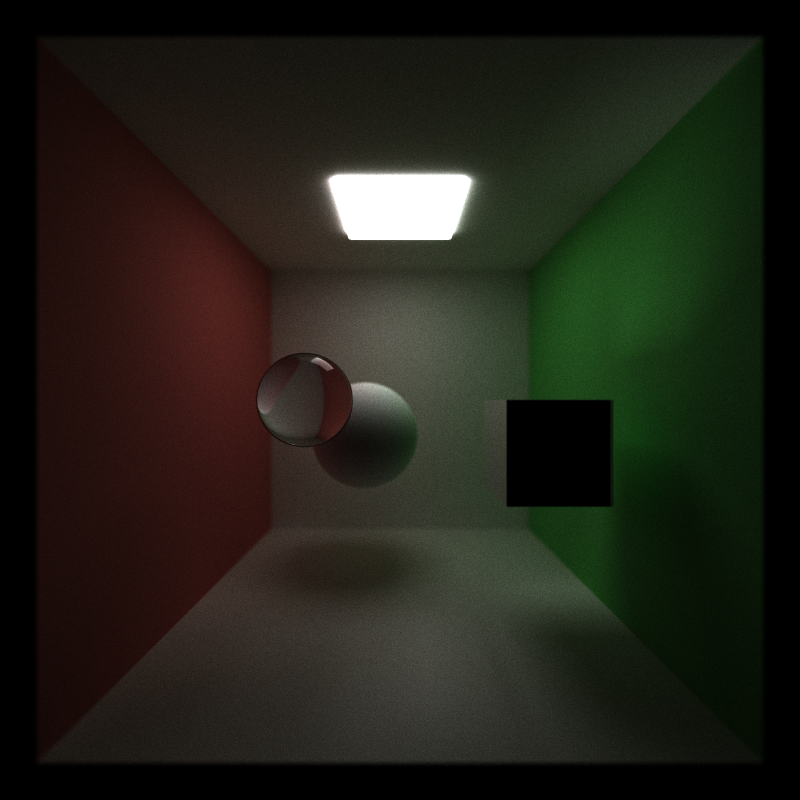
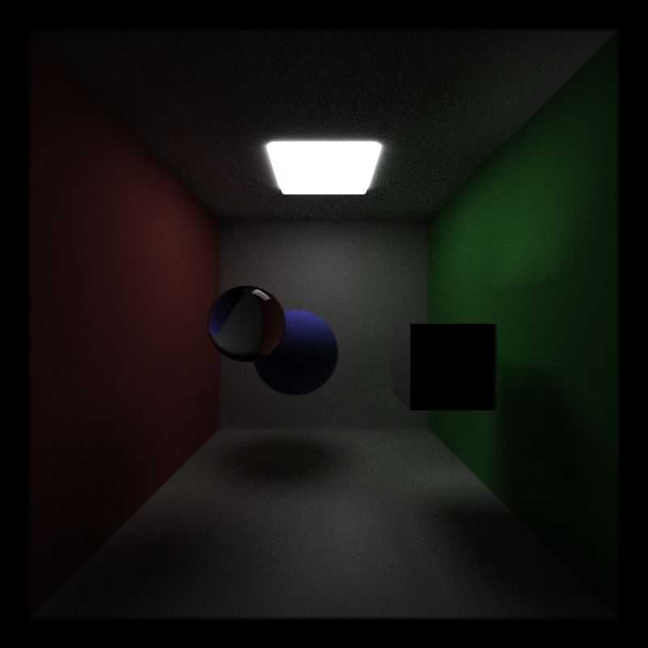
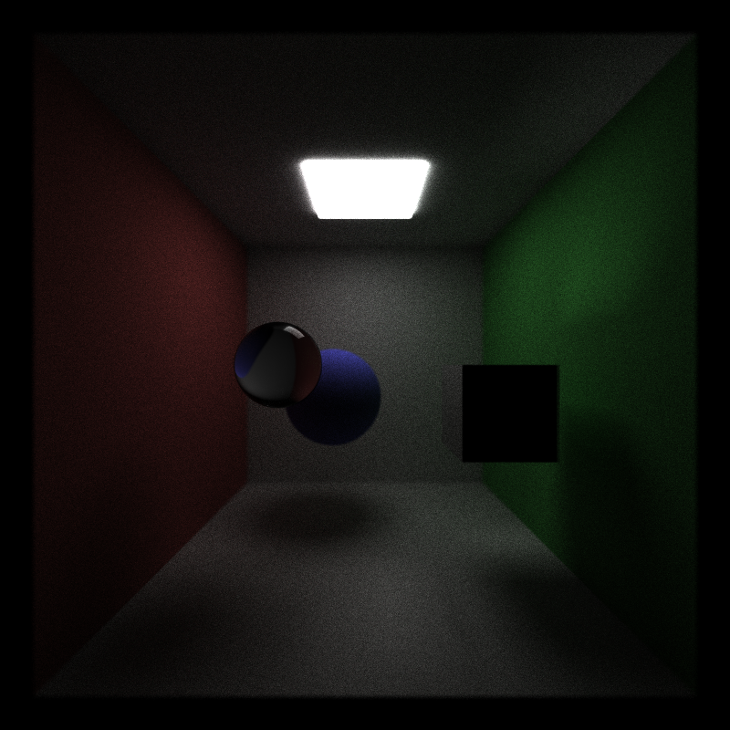

CUDA Path Tracer
================

**University of Pennsylvania, CIS 565: GPU Programming and Architecture, Project 3**

* Yanfu Ou
* Tested on: Ubuntu 24.04LTS, AMD Ryzen 7 7840HS, Nvidia RTX 5070 Laptop GPU(8GB VRAM), 64GB DDR4 RAM

### Features Implemented
1. Contiguous memory by material type 
2. Stochastic sampled antialiasing

| No antialiasing | Antialiasing |
| --- | --- |
|  |  |
|  |  |
In the image with no anti-alising, the sphere's edge have very obvious stair casing effect. 

3. Depth of Field (2pt)

| Focused on Cube | Focused on Sphere |
| --- | --- |
|  |  |

4. Refraction (2pt)
Blue Sphere in the back

| Front Left view | Inside Box Top View |
| --- | --- |
|  |  |

White Sphere in the Back

5. Direct Lighting (2pt)
Path Trace Depth of 1 

| No Direct Light | With Direct Lighting |
| --- | --- |
|  |  |

Path Trace Depth of 2 

| No Direct Light | With Direct Lighting |
| --- | --- |
|  |  |

6. Better Random Sequence (3pt)

| Iterations | With Random Sequence | Without Random Sequence |
| --- | --- | --- | 
| 8 iter |  |  |
| 16 iter |  |  |
| 64 iter |  |  |
| 128 iter |  |  |
| 256 iter |  |  |
| 512 iter |  |  |
| 1024 iter |  |  |

7. Russian Roulette (1pt) 
